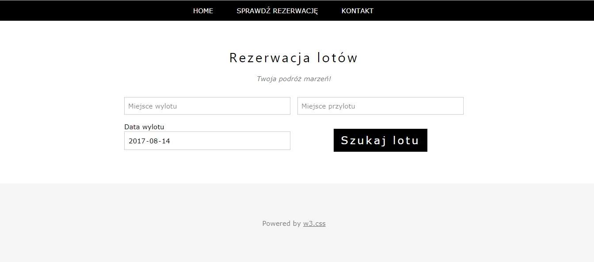
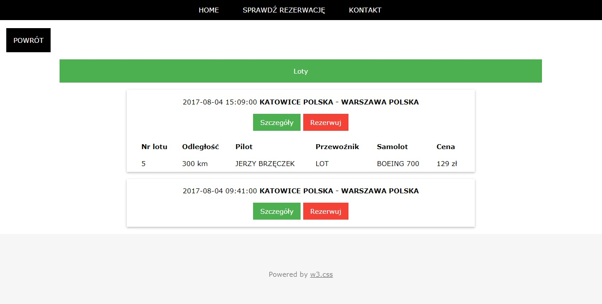

# Rezerwacja-lotow
Projekt na studia - rezerwacja biletów na lotnisku Katowice

Użyte technologie:
- Javascript
- CSS
- HTML

Do zarzadzania bazą danych użyto biblioteki ALASQL https://github.com/agershun/alasql

   

   
-

